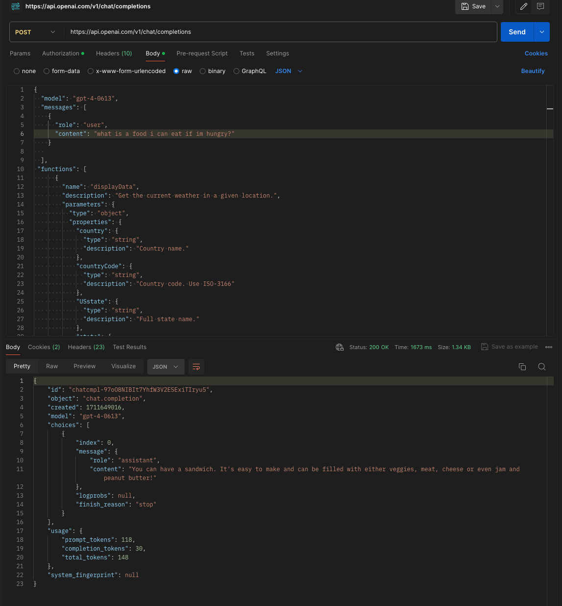
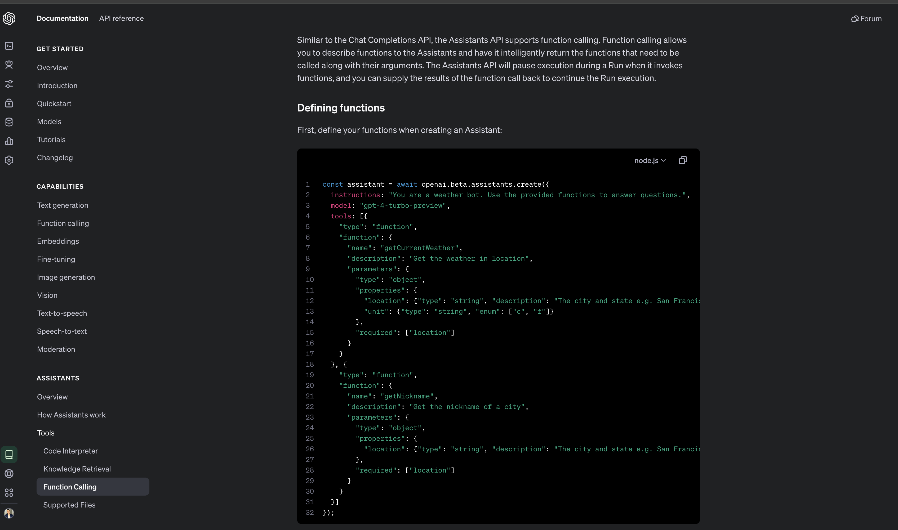

# aiWeather

## Overview

In the `aiWeather` project, we integrate advanced AI capabilities using OpenAI to create a tailored weather information service. By utilizing function calling, the application can dynamically respond to user queries about weather conditions.

### Function Calling with GPT-4

We employ OpenAI's GPT-4 model, known for its cutting-edge language understanding and generation capabilities. The decision to use GPT-4 is due to its ability to handle nuanced and context-rich user prompts which is essential for accurate function calling.

#### Defining Functions

Functions are defined to guide the AI on specific tasks, such as fetching weather data. This focused approach allows us to return only the requested information.

For instance, the function `getCurrentWeather` is designed to return weather conditions for a specified location, leveraging the WeatherAPI for accurate data.

### Why Use Function Calling?

Function calling is a strategic choice for this project as it narrows down the AI's response to be relevant and precise. It filters out unnecessary information and aligns the AI's responses with user expectations.

This approach is particularly useful when handling different user intents, allowing the AI to respond with weather information when prompted, and elegantly handling unrelated queries by displaying a custom error message.

### Special Notes

- **WeatherAPI Integration**: By integrating WeatherAPI, we ensure that the bot can access real-time and accurate meteorological data.
- **GPT-4's Role**: The choice of GPT-4 is pivotal for its advanced context understanding, ensuring that function calls result in relevant data retrieval.
- **Error Handling**: The system is designed to output a custom error message if a query falls outside the scope of weather-related inquiries, ensuring user interactions remain focused and purposeful.

With these components, `aiWeather` stands out as an intelligent platform for real-time weather information, driven by the latest advancements in AI.
